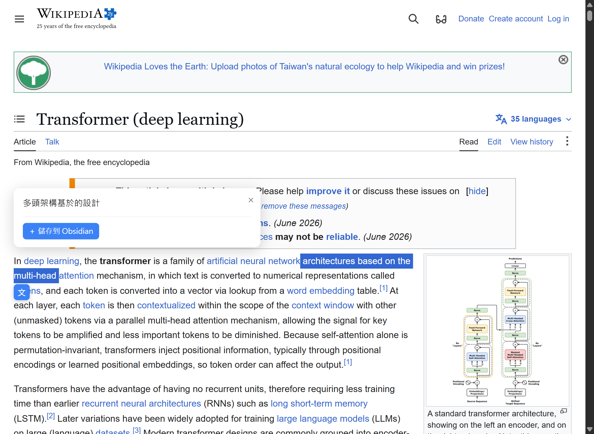
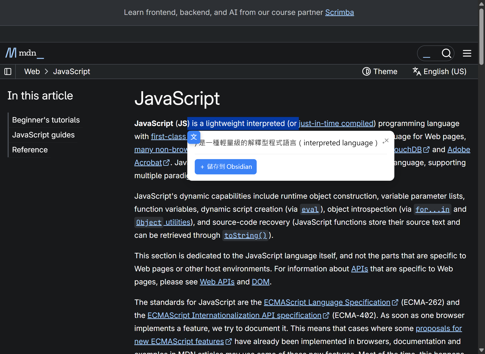
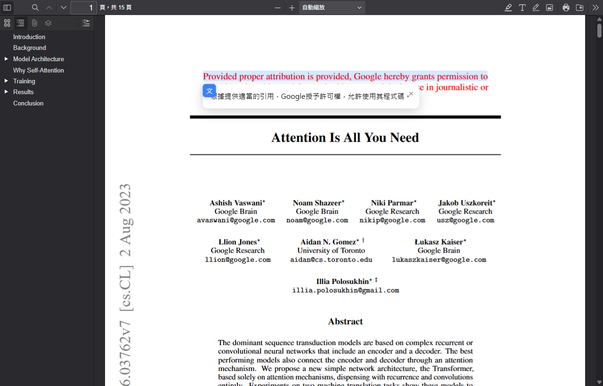
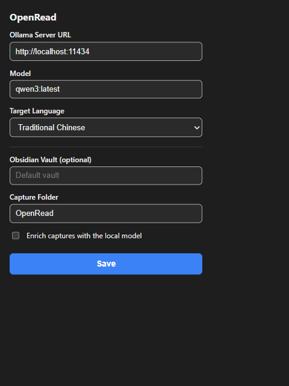

# OpenRead

> **Engineering reliable, _measurable_ streaming-LLM output — with translation as the vehicle.**

OpenRead is a Manifest V3 Chrome extension that translates any web page or local
PDF with a local LLM via Ollama — no key, no cloud — streaming the result in
place. The interesting part isn't calling the API — it's taming the
non-deterministic text a model emits in a latency-sensitive streaming UI, and
_proving_ the taming works.


---

## Demo

Select text on any page, click the floating **文**, and the
Traditional-Chinese translation streams in — here on the
[Wikipedia article for LLMs](https://en.wikipedia.org/wiki/Large_language_model),
translated by a local model:



The same selection UI works on developer docs and on PDFs — local or remote —
through a bundled PDF.js viewer (below: MDN, and a real arXiv paper):

| Developer docs (MDN) | Research PDF (arXiv) |
| --- | --- |
|  |  |

Everything is configured in a small popup — a local Ollama server URL, a model,
and a target language. No account, no API key:



> All screenshots are real end-to-end runs against a local `llama3.1` via Ollama —
> captured by the browser E2E harness, not mock-ups.

## Why this exists

An LLM told to "translate this" will happily also emit a preamble
(`Sure, here is the translation:`), think out loud (`The user wants…`), echo the
input back, wrap the output in quotes, or — for a Traditional-Chinese target —
leak Simplified characters. In a streaming UI these artifacts land on screen
before you can react.

OpenRead treats that as an **engineering problem with a measurable target**. The
cleanup logic is a pure, dependency-free core, unit-tested in isolation and
scored by an offline eval harness so improvements are quantified, not vibes.

## Reliability eval

`pnpm eval` runs the pure reliability layer over a curated set of real failure
modes and reports before/after rates. Fully offline and deterministic — no
Ollama server, no network — so the numbers are reproducible in CI.

| Metric                                             | Before | After    | Reduction |
| -------------------------------------------------- | ------ | -------- | --------- |
| Preamble / thinking leakage                        | 34.8%  | **0.0%** | 100%      |
| Input echo                                         | 17.4%  | **0.0%** | 100%      |
| Simplified-character leakage (Traditional targets) | 38.1%  | **0.0%** | 100%      |

_Measured over 23 curated fixtures (21 Traditional-Chinese targets). Regenerate
with `pnpm eval`; full report in [`eval/RESULTS.md`](eval/RESULTS.md)._

The pure core carries **100% function coverage and ~94% line coverage** across
85 unit tests (`pnpm test:cov`).

## How it works

- **Reliability layer** ([`src/core/sanitize.ts`](src/core/sanitize.ts)) —
  anchored preamble/thinking filters, echo removal, quote unwrapping.
- **Streaming assembler** ([`src/core/stream.ts`](src/core/stream.ts)) — a
  "reluctant buffer" holds only the opening tokens (where preamble hides) so the
  translation still paints fast, then streams the rest straight through.
- **Taiwan localization** ([`src/core/zh-convert.ts`](src/core/zh-convert.ts)) —
  OpenCC `s2twp` phrase-level Simplified→Traditional conversion, replacing v1's
  hand-rolled character map that corrupted `界面→界麵` and `公里→公裡`.
- **Same-language short-circuit**
  ([`src/core/language.ts`](src/core/language.ts)) — script detection skips the
  API entirely when a selection is already in the target language (zero latency,
  zero cost).
- **Cancellation-safe streaming**
  ([`src/api/ollama.ts`](src/api/ollama.ts) +
  [`src/entrypoints/background.ts`](src/entrypoints/background.ts)) — each
  request owns an `AbortController`; a new selection or a closed panel aborts the
  in-flight SSE with no shared mutable state to race on.
- **Fully local** — no cloud, no key, no telemetry. The selected text is sent
  only to a local Ollama server on your machine; nothing leaves your device.
  The server URL lives in `chrome.storage` and is read only by the background
  worker; it never travels over the message bus.

See [`docs/ARCHITECTURE.md`](docs/ARCHITECTURE.md) for the module map and the
streaming sequence diagram.

## Capture to Obsidian

Reading is only half the loop — OpenRead also turns any translated selection
into a note in your [Obsidian](https://obsidian.md) vault. Once a translation
streams in, a **＋ 儲存到 Obsidian** button drops a Markdown note — original,
translation, and a machine-readable YAML header — straight into your vault via
an `obsidian://new` URI. No extra permissions, no server; notes too large for a
protocol-handler URL fall back to the clipboard.

That header is a deliberate **handoff contract**. Every note is written
`status: raw`, so a stronger downstream model (a "second brain") can query the
unprocessed captures, synthesize them, and flip the flag. OpenRead does the
cheap, reliable part on-device and defers the expensive part — rather than
re-implementing a knowledge base it has no business owning.

Optionally, a small local model can pre-label a capture with a title, summary,
and tags. Small models are unreliable at structured output, so this is strictly
best-effort — and _measured_: `parseEnrichResponse` salvages usable metadata
from fenced, preamble-wrapped, and trailing-prose replies that a naive
`JSON.parse` drops.

| Metric                                              | Rate       |
| --------------------------------------------------- | ---------- |
| Naive `JSON.parse` yields an object                 | 42.9%      |
| Robust `parseEnrichResponse` yields usable metadata | **71.4%**  |

_Offline, deterministic run over 14 real small-model reply shapes; regenerate
with `pnpm eval:capture`, full report in
[`eval/CAPTURE-RESULTS.md`](eval/CAPTURE-RESULTS.md). This is why enrichment is
off by default — the raw capture is always the source of truth._

Set your vault, capture folder, and the enrichment toggle in the popup; leave
the vault blank to use whichever vault is currently open.

## Install (from source)

```bash
pnpm install
pnpm build
```

Then in Chrome: open `chrome://extensions`, enable **Developer mode**, click
**Load unpacked**, and select `.output/chrome-mv3`.

### Ollama setup

OpenRead translates through a local [Ollama](https://ollama.com/) server — no
API key required.

1. [Install Ollama](https://ollama.com/).
2. Pull a model: `ollama pull qwen2.5`.
3. Start the server: `ollama serve`.
4. Allow the extension's origin through Ollama's CORS by setting
   `OLLAMA_ORIGINS=chrome-extension://*` before starting it:
   - **macOS**: `launchctl setenv OLLAMA_ORIGINS "chrome-extension://*"`, then restart Ollama
   - **Linux**: set `OLLAMA_ORIGINS=chrome-extension://*` in the systemd service or shell env, then restart Ollama
   - **Windows**: set a user environment variable `OLLAMA_ORIGINS=chrome-extension://*`, then restart Ollama

Open the toolbar popup and set the Ollama server URL (default
`http://localhost:11434`) and model (default `qwen2.5`), plus a target
language.

## Usage

- **Web pages** — select text; click the floating **文** icon; the translation
  streams into a panel.
- **PDFs** — navigate to any `.pdf`; OpenRead redirects it into a bundled
  PDF.js viewer where the same selection translator works on the rendered text.

## Development

```bash
pnpm dev          # HMR dev build (Chrome); pnpm dev:firefox for Firefox
pnpm test         # Vitest unit suite
pnpm test:cov     # …with coverage
pnpm eval         # reliability eval -> eval/RESULTS.md
pnpm eval:capture # capture-enrichment eval -> eval/CAPTURE-RESULTS.md
pnpm compile      # tsc --noEmit (strict)
pnpm lint         # ESLint
pnpm build        # production build -> .output/chrome-mv3
```

See [`CONTRIBUTING.md`](CONTRIBUTING.md) for the full workflow.

## Tech stack

TypeScript (strict) · [WXT](https://wxt.dev) · Vitest · ESLint + Prettier ·
[OpenCC](https://github.com/nk2028/opencc-js) · Ollama · GitHub Actions

## License

[MIT](LICENSE)
