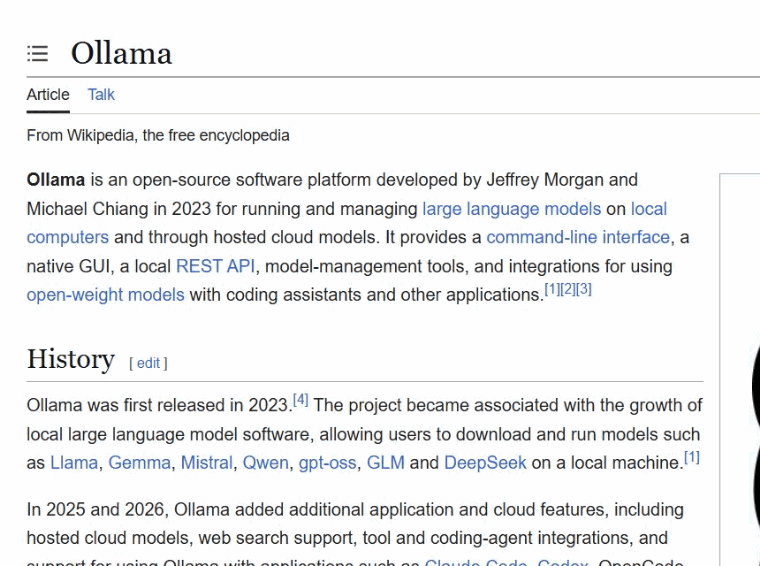
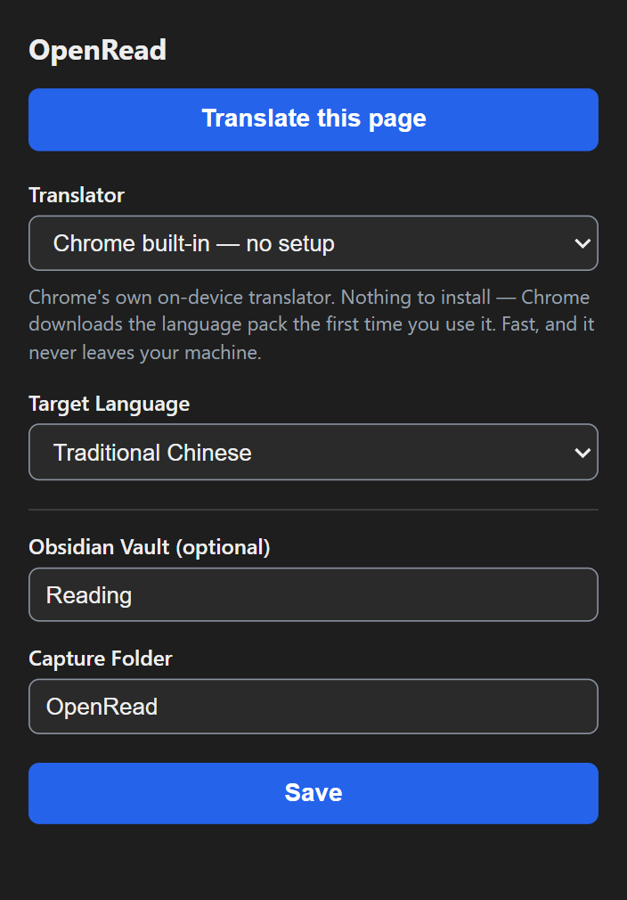
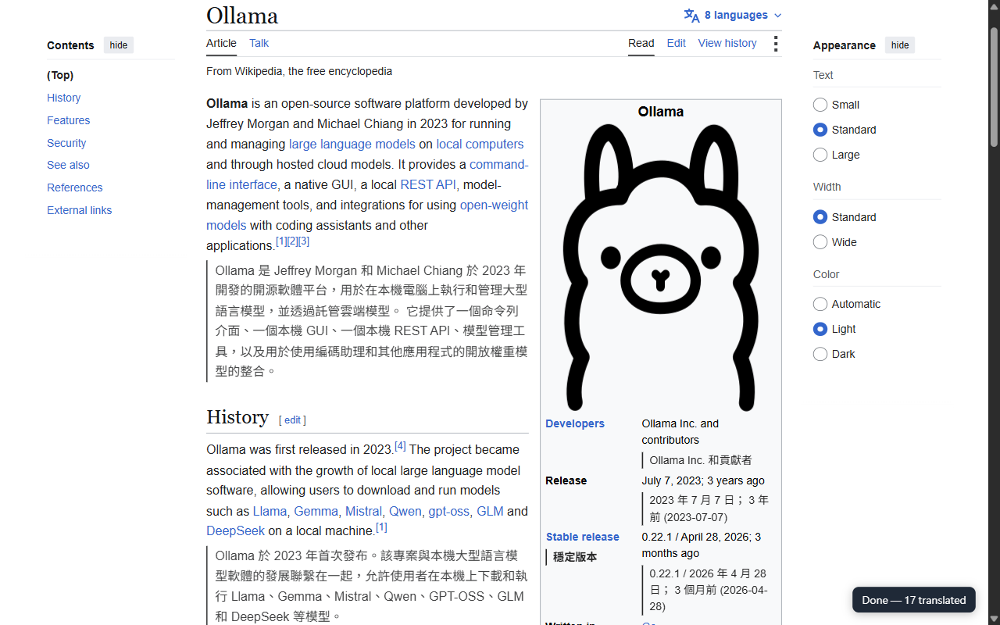
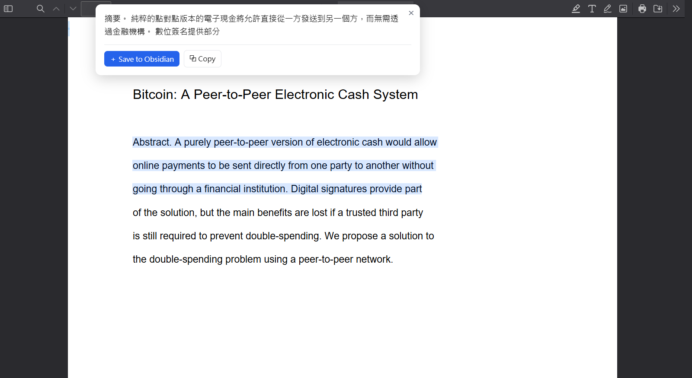

# OpenRead

> **Read the web, your PDFs and your books in your own language, without
> sending a word of it to anyone.** No account, no API key, no cloud.



<sub>Real time, unedited, on the default engine — nothing installed.</sub>


[](https://chromewebstore.google.com/detail/mopclgoefogojkfmigfjpbmnnoiodnmb)
[](https://github.com/0Smallcat0/OpenRead/releases/latest)

## Why

- **Some things cannot go in a cloud translator.** Unpublished drafts,
  contracts, medical records, anything under NDA. Every engine here runs on
  your own machine.
- **Bilingual, not replaced.** The translation goes _under_ each paragraph, so
  a sentence that looks wrong can be checked against the original instead of
  taken on faith.
- **PDFs too.** Papers and specs open in a bundled viewer where selecting text
  works the same as on a web page — and a whole paper translates page by page,
  with the layout left alone.
- **And EPUBs.** A book opens in a reader of its own, with its contents, its
  pictures and your place in it kept. Ask for a translation once and it follows
  you from chapter to chapter.
- **Traditional Chinese that reads like Taiwan.** Most tools translate into
  Simplified and convert character by character, which produces `界面`, `公裡`,
  `數據庫` where a Taiwanese reader expects `介面`, `公里`, `資料庫`. OpenRead
  converts at the phrase level and corrects the vocabulary on the way out.

## Install

[**⬇ Add to Chrome from the Chrome Web Store**](https://chromewebstore.google.com/detail/mopclgoefogojkfmigfjpbmnnoiodnmb).
One click, and it updates itself.

If you would rather not install from the store,
[download the latest release](https://github.com/0Smallcat0/OpenRead/releases/latest),
unzip it, open `chrome://extensions`, turn on **Developer mode**, click
**Load unpacked**, and pick the unzipped folder. The same package works in
Edge, from `edge://extensions`.

Either way, that is the whole setup. OpenRead uses Chrome's own on-device
translator, whose language pack Chrome downloads once per language pair — about
350 MB, measured at 82 seconds on a 4 MB/s connection. That download starts the
moment the extension is installed rather than the first time you press
translate, and the extension holds it open until it lands: Chrome does not
resume an interrupted one, it waits three minutes and then starts over. After
it arrives, a page takes about two seconds.

<p align="center">
  
</p>

### What it needs, and where it stops

- **Chrome 138 or later, on desktop.** The built-in translator is Chrome's, not
  this extension's, so a browser without it has nothing to run on. **Edge
  works** — measured on Edge 151, where the translator is there and a cold
  first translation takes about twenty seconds — with one difference: Edge has
  already claimed the three suggested shortcuts for itself, so it registers
  them unbound. Everything is still reachable from the right-click menu and the
  popup, and the keys can be assigned by hand at `edge://extensions/shortcuts`.
  **Firefox is not supported**, and the honest reason is that it has no
  equivalent API: the only engine left there is Ollama, which means a server
  and a five-gigabyte model — the opposite of what this is for.
- **Thirty-nine target languages**, every one probed against a real Chrome
  rather than taken from documentation. The source language is whatever the
  page is in — that side is not a list.
- **Three settings for how it looks**: the original beside the translation or
  the translation alone; a line, nothing, a dashed underline or a tinted
  background; smaller, the same, or larger. They apply to a page you are
  already looking at, without re-translating it.
- **The first translation of a language pair waits for a download.** Chrome
  fetches the model itself, once per pair per browser profile — 30 seconds to
  two minutes. The popup says whether yours is ready and offers to fetch it
  before you need it, so the wait happens while you are not waiting.
- **Chrome decides which pairs exist.** It downloads packs per language pair,
  and a pair it has no pack for is one the built-in engine cannot do. When that
  happens OpenRead falls back to Ollama; with no Ollama configured, that is
  where the attempt ends.

## Use it

- **Whole page** — right-click → **Translate this page with OpenRead**, or the
  button in the popup. What you can see is translated first, and the page keeps
  up on its own as you scroll and as it loads more, so an article or a feed
  needs one press rather than one per screen. Content inside an iframe — an
  embedded document, a comment thread — is translated too; an ad slot in one is
  not, on the strength of what is in the frame rather than where it sits. A
  badge counts progress and offers Stop. Do it again to put the page back.
- **Without asking** — in the popup, set **Translate automatically** to _Pages
  in another language_ and they translate themselves as they load. Off by
  default, and any site can be excluded with one checkbox.
- **One paragraph** — hold **Alt** and point at it. The paragraph that stopped
  you, without a drag and without rewriting the page. Remappable to Ctrl or
  Shift, or off, in the popup.
- **What you are writing** — press **`Ctrl+Shift+K`** in any text box and it is
  replaced with its translation. Its own output language in the popup, English
  by default. `Ctrl+Z` takes it back.
- **One selection** — select text, click the floating **文**, or press
  **`Ctrl+Shift+Y`**. Escape closes the panel.
- **Names it keeps getting wrong** — list them in the popup, one a line.
  `OpenRead` on its own keeps the name as written; `bug = 瑕疵` pins how a term
  is translated. The built-in engine takes no prompt, so the term is held out
  of the sentence and put back after.
- **A paper** — open any `.pdf` and it lands in the bundled viewer, where
  selecting text works exactly as it does on a web page. Press translate and
  each page's translation is placed under the page itself, so the layout, the
  figures and the equations stay as the author set them. For a PDF already on
  your disk, turn on **Allow access to file URLs** in `chrome://extensions` →
  **Details** first; Chrome withholds `file://` from every extension until you
  do.
- **A book** — press **Open an EPUB…** in the popup, then choose the file or
  drop it onto the page. Contents down the side, Next and Previous in the
  toolbar, and your place kept per book, so closing the tab is not losing it.
  Press **Translate** once and every chapter after it arrives translated. The
  book is read out of the file in your hands: nothing is uploaded, and nothing
  inside it is fetched from anywhere — a picture comes from the archive, and a
  chapter that points at a remote image simply does not get one.

| The whole page, bilingual                                                                                                                                                     | A paper, in the bundled PDF viewer                                                                      |
| ----------------------------------------------------------------------------------------------------------------------------------------------------------------------------- | ------------------------------------------------------------------------------------------------------- |
|  |  |

## Save to Obsidian

Any translation can go into your [Obsidian](https://obsidian.md) vault as
Markdown, in one tap, through an `obsidian://new` URI — no extra permissions
and no server:

```markdown
---
title: 'Ollama'
source: 'Wikipedia'
url: https://en.wikipedia.org/wiki/Ollama
captured: 2026-08-06T03:41:00.000Z
from: en
to: 'Traditional Chinese'
status: raw
tags: [openread]
---

## Original

> Ollama is an open-source software platform…

## Translation

Ollama 是 Jeffrey Morgan 和 Michael Chiang 於 2023 年開發的開源軟體平台…
```

`status: raw` is a deliberate handoff: a stronger downstream model can pick up
the unprocessed captures, synthesize them, and flip the flag. OpenRead does the
cheap, reliable part on-device and leaves the expensive part to something whose
job it is.

## Without a browser

The same pipeline as a command and as an MCP server, so a script or an agent
can translate locally too:

```bash
npx openread "The quick brown fox jumps over the lazy dog."
cat paper.txt | npx openread --to Japanese
claude mcp add openread -- npx -y openread mcp
```

Not a reimplementation — `src/node/translate.ts` calls the identical function
the extension calls, and a test pins the CLI's defaults against the
extension's.

## Two engines

|                           | Chrome built-in _(default)_ | Ollama                    |
| ------------------------- | --------------------------- | ------------------------- |
| To install                | nothing                     | a server + a 5.2 GB model |
| A 44-block article        | **~2 s**                    | 54 s                      |
| chrF on 27 fixtures       | 36.5                        | **46.4**                  |
| Reads surrounding context | no                          | yes                       |
| Choose the model          | no                          | yes                       |
| Capture enrichment        | no                          | yes                       |

Both run entirely on your machine, and both numbers come from the same 27
fixtures against the same Taiwanese references — the built-in engine's are in
[`eval/BUILTIN-RESULTS.md`](eval/BUILTIN-RESULTS.md), the model's in
[`eval/BENCHMARK-RESULTS.md`](eval/BENCHMARK-RESULTS.md). Ten chrF is the price
of installing nothing; a whole segment finishes on the built-in engine in about
the time Ollama takes to paint its first character.

Switch in the popup; `ollama pull qwen3` and `ollama serve` is the whole Ollama
setup, with no `OLLAMA_ORIGINS` step — [here is why](docs/ENGINEERING.md#how-it-works).

## Privacy

No account, no API key, no analytics, and no remote endpoint anywhere in the
code. On the default engine the extension makes no network request at all; on
the Ollama engine, only to the server URL you configured, on your own machine.
Permissions are `storage`, `activeTab`, `contextMenus` and
`declarativeNetRequest` — the last one strips the `Origin` header from this
extension's own requests to your Ollama server, scoped so a web page's requests
can never match it. [Full policy](PRIVACY.md).

That is the author of the extension telling you the extension is safe, which is
worth very little. So it is also a test you can run:

```bash
pnpm build && pnpm e2e:egress
```

It loads the built extension into a real Chrome, translates a page served from
`127.0.0.1`, and records every request every part of the extension makes. It
fails if one left the machine, if one went to Ollama — which would mean the
default engine was not what served the run — or if nothing was translated at
all, since that is the easy way to send nothing and prove nothing.

## Development

```bash
pnpm install
pnpm build        # -> .output/chrome-mv3, load it unpacked
pnpm test         # 780 unit tests
pnpm eval         # offline reliability eval -> eval/RESULTS.md
pnpm eval:builtin # score the default engine in a real Chrome -> eval/BUILTIN-RESULTS.md
pnpm bench        # live model benchmark (needs Ollama)
pnpm shoot        # re-shoot every screenshot and the clip on this page
pnpm e2e:page     # whole-page translation in a real Chrome, end to end
pnpm e2e:stress   # hostile pages: infinite feeds, route swaps, rapid toggling
pnpm e2e:egress   # prove the default engine sends nothing, in a real Chrome
pnpm e2e:epub     # a real .epub opened, read and translated in a real Chrome
pnpm e2e:first-run # what a brand-new install does on a brand-new profile
pnpm e2e:prefetch  # prove installing it starts the language-pack download
pnpm e2e:page-pack # prove opening a foreign page starts its pack too
pnpm e2e:selection # select text, click the 文 icon, read what comes back
```

**[How it is built →](docs/ENGINEERING.md)** — the reliability layer, the
streaming assembler, the evals, the model benchmark, and the bugs that produced
each of them. [`docs/ARCHITECTURE.md`](docs/ARCHITECTURE.md) has the module map;
[`CONTRIBUTING.md`](CONTRIBUTING.md) has the workflow.

TypeScript (strict) · [WXT](https://wxt.dev) · Vitest ·
[OpenCC](https://github.com/nk2028/opencc-js) · Ollama

## License

[MIT](LICENSE)
